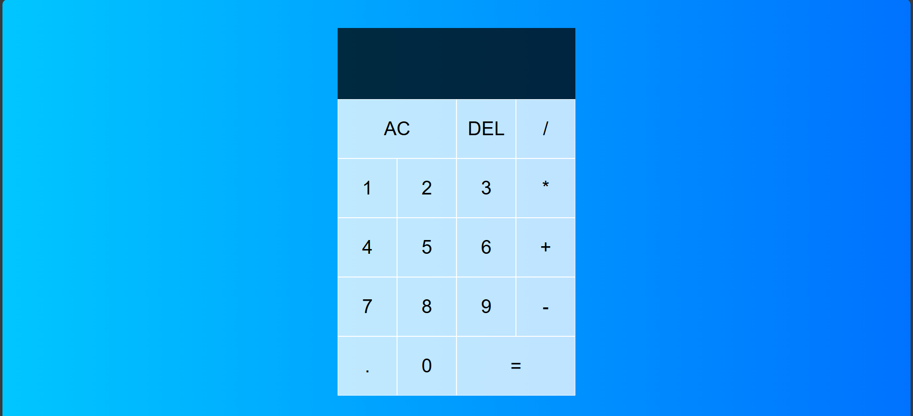

# Basic Calculator App

A simple yet functional calculator built using **HTML**, **CSS**, and **JavaScript**. This project demonstrates core concepts of front-end development including DOM manipulation, event handling, and clean UI design.

## 🚀 Features

- Perform basic arithmetic operations: Addition, Subtraction, Multiplication, Division
- Clear all input with `AC`
- Delete the last digit using `DEL`
- Supports decimal inputs
- Responsive and user-friendly interface

 💡 Technologies Used

- **HTML5** for the structure
- **CSS3** for styling
- **Vanilla JavaScript** for logic and interactivity

 📁 Project Structure

calculator/
├── index.html # Main HTML file
├── style.css # Styling file
└── script.js # JavaScript logic

 🖥️ Demo

You can clone the repository and open `index.html` in any modern browser to run the calculator locally.
git clone https://github.com/yourusername/calculator.git
cd calculator
open index.html   # or simply double-click the file

📸 Screenshots

🛠️ How It Works
The Calculator class handles all calculator operations and logic.

DOM elements are selected using querySelector and event listeners are added to buttons.

Arithmetic operations are performed based on user interaction and input is displayed in real time.

📌 Key Concepts
Object-Oriented JavaScript

DOM Traversal and Manipulation

Event-Driven Programming

Clean and Responsive UI Design

Feel free to fork, star ⭐, or contribute to improve the calculator!

- Add a `screenshot.png` showing the calculator interface for better presentation.
- Create a `LICENSE` file if you're adding a license (e.g., MIT License).
- Replace `yourusername` in the clone URL with your actual GitHub username.

Would you like me to generate the screenshot or license file for you as well?

